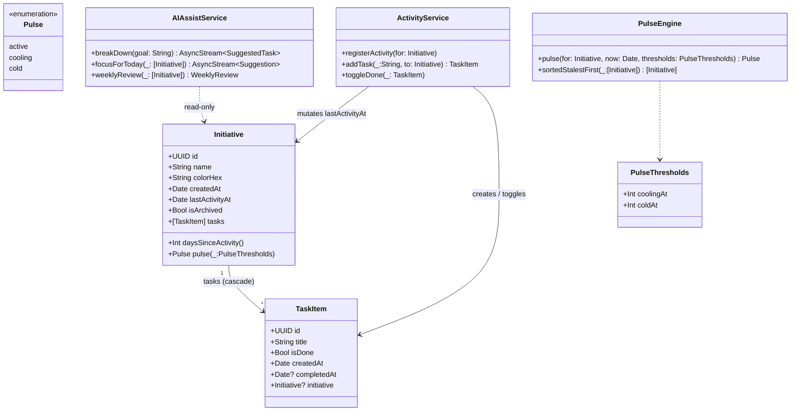
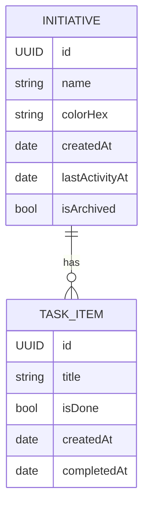

# Momentum

> A personal command center for someone running several parallel initiatives. Each initiative has a visible **pulse**; the app surfaces which one is going cold and the smallest next step to revive it.

<p>
  
  
  
  
  
  
</p>

---

## The problem

> "I start five things strong, silently let two die, and don't notice until it's too late."

Momentum makes neglect **visible before abandonment**.

Every initiative carries a **pulse** — `active` (0–2 days), `cooling` (3–6 days), `cold` (7+ days) — computed from a single anchor: `lastActivityAt`. The home list sorts stalest-first, so the thing dying floats to the top, unprompted. Add a task or check one off, and the pulse resets. Editing, renaming, reordering — *do not count*. Only forward motion.

This is a deliberately small idea, carried by one mechanic, all the way to the dashboard, the notifications, the widgets, and the AI suggestions.

---

## Features

- **Pulse mechanic** — colored dot/ring + "Nd" days-since on every surface (vital-signs styling).
- **Stalest-first home** — your most-neglected initiative finds you, not the other way around.
- **Initiatives + tasks** — a thin hierarchy, fast inline entry, swipe to delete, drag to reorder, drag across initiatives on iPad.
- **Today triage** — a single screen for "what should I move today?" with a "Needs attention" banner for cold initiatives.
- **Momentum dashboard** — animated pulse rings, a "going cold" leaderboard, a 14/30-day activity chart.
- **On-device AI Assist** — three jobs, all suggestions, never autonomous: *break a goal into tasks*, *what to focus on today*, *weekly review with one revival step per cold initiative*.
- **CloudKit sync** — multi-device, no accounts, no servers.
- **Home-screen widgets + Shortcuts** — the coldest initiative on your lock screen; "add task to X" from Siri.
- **Accessibility-first** — pulse state announced as text, not communicated by color alone; Reduce Motion fallbacks; Dynamic Type to XXL.

---

## Screenshots

> Coming with the P4 build. The shipped mockup is dark-mode-first; light mode ships alongside.

| Initiatives | Detail | Momentum |
| --- | --- | --- |
| _(placeholder)_ | _(placeholder)_ | _(placeholder)_ |

---

## Tech stack

| Layer | Choice | Notes |
|---|---|---|
| UI | **SwiftUI** | iOS 26.5 / iPadOS, MainActor-by-default |
| State | **`@Observable`** + `@Query` + `@Environment` | MV — no separate ViewModel layer |
| Persistence | **SwiftData** | `@Model` types, `ModelContext` from environment |
| Sync | **CloudKit private DB** | via SwiftData's CloudKit container config |
| Charts | **Swift Charts** | activity history, sparkline |
| Animation | **`Canvas`** + phase/keyframe animation, `matchedGeometryEffect` | pulse rings |
| Notifications | **`UserNotifications`** + `BGAppRefreshTask` | local only |
| AI | **Foundation Models** (on-device) | `@Generable` for structured outputs |
| Widgets / Siri | **WidgetKit** + **App Intents** | deep-links into initiative detail |
| Concurrency | Swift Concurrency, MainActor isolation by default | `Task.detached` only where needed |
| Dependencies | **None** | first-party Apple frameworks only |

---

## Architecture at a glance

We use **Model–View with `@Observable`** — not MVVM, not TCA. The full rationale is in [docs/ARCHITECTURE.md](docs/ARCHITECTURE.md).

```mermaid
flowchart TB
  subgraph UI["SwiftUI Views"]
    Today["TodayView"]
    List["InitiativesListView"]
    Detail["InitiativeDetailView"]
    Dash["MomentumDashboardView"]
    AI["AIAssistSheet"]
    Settings["SettingsView"]
  end

  subgraph State["@Observable State / Services"]
    Activity["ActivityService"]
    Pulse["PulseEngine"]
    Notif["NotificationService"]
    AIService["AIAssistService"]
    Sync["SyncStatusService"]
  end

  subgraph Data["Persistence"]
    Container["ModelContainer (SwiftData + CloudKit)"]
    Initiative["Initiative @Model"]
    Task["TaskItem @Model"]
  end

  UI -->|@Query| Container
  UI -->|.environment| State
  State --> Container
  Container --> Initiative
  Container --> Task
```

### Class diagram (P1–P6 surface)



### Data model



Full schema, query patterns, and CloudKit constraints in [docs/DATA-MODEL.md](docs/DATA-MODEL.md).

---

## System design choices

These are the decisions that shape the codebase — and the ones we'd defend in a code review.

### 1. **MV + `@Observable`, not MVVM**
SwiftUI's data flow already provides the bindings, observation, and lifecycle that a ViewModel layer usually exists to wrap. We get testability where it matters (a pure `PulseEngine`, an `ActivityService` you can drive directly) without the per-screen VM ceremony.

### 2. **The pulse is derived, never stored**
`Pulse` is a function of `lastActivityAt` and a clock. Storing it would mean syncing it, migrating it, and keeping it consistent with itself. Computing it keeps the source of truth in one place.

### 3. **Only forward motion counts as activity**
`registerActivity()` is called from exactly two events: adding a task, and completing a task. Renaming, recoloring, reordering — *do not* reset the pulse. If everything counted, the metric would always look healthy and the app's whole point would dissolve.

### 4. **MainActor by default**
The project enables `SWIFT_DEFAULT_ACTOR_ISOLATION = MainActor`. `ModelContext` is main-actor-bound; UI is too. We only annotate `nonisolated` / use `Task.detached` for genuinely background work (notification sweeps, on-device LLM streaming, CloudKit reconciliation).

### 5. **On-device AI, suggestions only**
Foundation Models + `@Generable` give us structured outputs without a network round-trip, a key, or a third-party provider. The AI layer is **read-only** — it can read snapshots of state and return suggestions; writes go through `ActivityService` only after the user confirms. The model can't take an action you didn't approve.

### 6. **CloudKit, not a backend**
Sync without accounts, without servers, without a privacy policy footnote. SwiftData's CloudKit configuration absorbs the plumbing; we only own the schema constraints (all non-optional properties default, inverses required, no unique constraints beyond `id`).

### 7. **Feature-folder layout, modular-ready**
Code groups by feature (`Features/Initiatives`, `Features/Today`, …) so P8 modularization is a `git mv` to SPM targets, not a rewrite.

### 8. **Accessibility is not a P7 surprise**
Pulse state is *announced as text*, never communicated by color alone, from P1. Animations gate on Reduce Motion. Dynamic Type is exercised from P2 onward.

### 9. **No dependencies**
First-party Apple frameworks only. The cost of a third-party library — version drift, security review, license noise — isn't paid back at this size.

---

## Project status & roadmap

| Phase | Theme | Status |
|---|---|---|
| **P1** | Core loop on iPhone — list / detail / create + minimal pulse | 🚧 not started |
| **P2** | iPad + adaptive | ⏳ |
| **P3** | CloudKit sync | ⏳ |
| **P4** | Momentum visuals (pulse rings, dashboard) | ⏳ |
| **P5** | Today + nudges (notifications) | ⏳ |
| **P6** | AI Assist (Foundation Models, on-device) | ⏳ |
| **P7** | Widgets, Shortcuts, accessibility, ship | ⏳ |
| **P8** | Optional — macOS, tests, modularization | ⏳ |

Detailed deliverables, surfaces practiced, and exit criteria for each phase: [docs/PHASES.md](docs/PHASES.md).

---

## Build & run

```bash
# Open in Xcode and ⌘R
open Momentum.xcodeproj
```

Or from the command line:

```bash
# Build for the iOS Simulator
xcodebuild -project Momentum.xcodeproj -scheme Momentum \
  -destination 'platform=iOS Simulator,name=iPhone 17 Pro' build

# Run tests (no test target yet — added in P8)
xcodebuild -project Momentum.xcodeproj -scheme Momentum \
  -destination 'platform=iOS Simulator,name=iPhone 17 Pro' test
```

Adjust `-destination` to a simulator that exists locally — `xcrun simctl list devices available`.

> **Adding files:** the Xcode target uses `PBXFileSystemSynchronizedRootGroup` on `Momentum/`. Any `.swift` file added under that root is picked up automatically. Don't hand-edit `project.pbxproj` to register sources.

---

## Documentation

| Doc | What's inside |
|---|---|
| [docs/SPEC.md](docs/SPEC.md) | Source of truth for features, screens, copy, out-of-scope. |
| [docs/ARCHITECTURE.md](docs/ARCHITECTURE.md) | Architectural choices, component & class diagrams, folder layout, concurrency. |
| [docs/DATA-MODEL.md](docs/DATA-MODEL.md) | Entities, ER diagram, SwiftData sketches, activity rules, CloudKit constraints. |
| [docs/PHASES.md](docs/PHASES.md) | P1–P8 with deliverables and exit criteria. |

---

## Privacy

- 100% on-device. No backend. No analytics SDKs.
- Sync uses the device's existing iCloud account via CloudKit's private database. No login screen ever appears.
- AI features use Apple's on-device Foundation Models — prompts and outputs never leave the device.

---

## Acknowledgements

The vendored agent skills under `.claude/skills/` come from the wonderful work of [twostraws](https://github.com/twostraws):

- [SwiftUI-Agent-Skill](https://github.com/twostraws/SwiftUI-Agent-Skill)
- [SwiftData-Agent-Skill](https://github.com/twostraws/SwiftData-Agent-Skill)
- [Swift-Concurrency-Agent-Skill](https://github.com/twostraws/Swift-Concurrency-Agent-Skill)

All MIT-licensed.

---

## License

TBD before public release.
