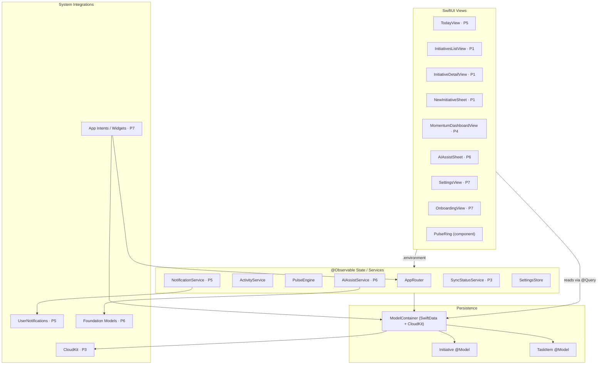
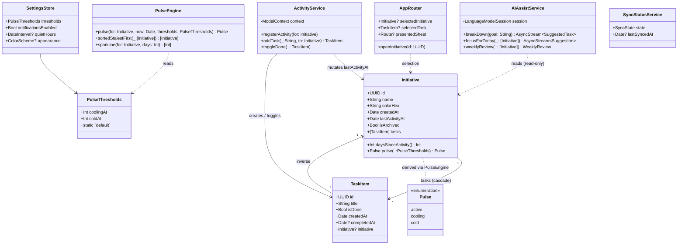

# Momentum — Architecture

> System-design choices and rationale. The **what** lives in [SPEC.md](SPEC.md); the data shape in [DATA-MODEL.md](DATA-MODEL.md).

---

## 1. Guiding Principles

| Principle | Implication |
|---|---|
| **On-device, private, free.** | No backend. SwiftData + CloudKit private DB. No analytics SDK. |
| **MainActor by default.** | The Xcode target sets `SWIFT_DEFAULT_ACTOR_ISOLATION = MainActor` and `SWIFT_APPROACHABLE_CONCURRENCY = YES`. Only annotate `nonisolated` / explicit actors when we intentionally leave the main actor (e.g. background imports, on-device LLM work). |
| **Lean toward Apple's current grain.** | SwiftUI + `@Observable` + SwiftData + Swift Charts + App Intents + Foundation Models. No third-party deps planned. |
| **Make neglect visible.** | The data model is shaped around the pulse mechanic; UI surfaces freshness aggressively. |
| **Modular-ready, not modular-yet.** | Folder structure mirrors features so P8 can lift them into SPM targets without a rewrite. |

---

## 2. Architectural Pattern: **MV + `@Observable`**

We use **Model–View** with SwiftUI's modern data flow — *not* a ViewModel layer.

- **Models** are `@Model` SwiftData entities (`Initiative`, `TaskItem`) plus value types (`Pulse`, `PulseThresholds`).
- **State** is held by SwiftUI itself (`@State`, `@Environment`, `@Query`) and by small `@Observable` classes when state needs to be shared between sibling views (e.g. `AppRouter`, `SyncStatus`).
- **Services** are small `@Observable` (or `actor`) types injected via `.environment(...)`. They never own UI state; they expose operations (`registerActivity(for:)`) and observable status (`syncState`).
- **Views** are the composition point. They read SwiftData with `@Query` and write through the `ModelContext` from the environment.

### Why not MVVM?

A dedicated VM per screen mostly proxies SwiftData and SwiftUI bindings — extra files, extra ceremony, no testability win over `@Observable` services. We keep VM-like state only where multiple views share it.

### Why not TCA / Redux?

The app's state is naturally local and persisted. The cost of a reducer layer is not paid back by the size of this surface area.

---

## 3. Top-Level Component Diagram



---

## 4. Class Diagram (P1–P6 surface)



`AIAssistService` returns suggestions; the **view** is responsible for writing them through `ActivityService` once the user confirms. The service itself never mutates the store.

---

## 5. Folder Structure

Mirrors features so P8 modularization is a *rename*, not a rewrite. Inside each feature, MV.

```
Momentum/
  MomentumApp.swift              // @main, ModelContainer, environment wiring
  Models/                        // @Model + value types
    Initiative.swift
    TaskItem.swift
    Pulse.swift
    PulseThresholds.swift
  Services/                      // @Observable / actors, no UI
    ActivityService.swift
    PulseEngine.swift
    SettingsStore.swift
    NotificationService.swift    // P5
    SyncStatusService.swift      // P3
    AIAssistService.swift        // P6
  Features/
    Initiatives/                 // P1
      InitiativesListView.swift
      InitiativeDetailView.swift
      NewInitiativeSheet.swift
      InitiativeRow.swift
    Today/                       // P5
      TodayView.swift
      AttentionBanner.swift
    Momentum/                    // P4
      MomentumDashboardView.swift
      PulseRingGrid.swift
      ActivityChart.swift
    AIAssist/                    // P6
      AIAssistSheet.swift
      SuggestedTaskRow.swift
    Settings/                    // P7
      SettingsView.swift
    Onboarding/                  // P7
  Components/                    // shared, presentational
    PulseRing.swift
    PulseDot.swift
    DaysSinceLabel.swift
  Routing/
    AppRouter.swift
    DeepLink.swift               // P7
  Widgets/                       // P7 (separate target)
  Resources/
    Localizable.xcstrings
    Assets.xcassets              // currently at Momentum/Assets.xcassets
```

> **Build note:** The Xcode target uses `PBXFileSystemSynchronizedRootGroup` on `Momentum/`. Any `.swift` added under that root is automatically picked up — no `project.pbxproj` edits required.

---

## 6. State & Data Flow

```mermaid
sequenceDiagram
  autonumber
  actor User
  participant V as InitiativeDetailView
  participant A as ActivityService
  participant C as ModelContext (SwiftData)
  participant CK as CloudKit (P3)

  User->>V: Tap checkbox on TaskItem
  V->>A: toggleDone(task)
  A->>C: task.isDone = true; task.completedAt = .now
  A->>C: task.initiative.lastActivityAt = .now
  C-->>V: @Query observes change → re-render
  C-->>CK: persistent history syncs in background
  Note over V: PulseEngine recomputes (derived, not stored)
```

**Key invariant:** `lastActivityAt` is only ever written by `ActivityService`. The view never touches it directly — that keeps the "what counts as activity" rule in one place.

---

## 7. Concurrency Model

- The target compiles with `SWIFT_DEFAULT_ACTOR_ISOLATION = MainActor`, so types are MainActor-isolated unless we say otherwise. SwiftData's `ModelContext` is main-actor-bound, which fits.
- **Background work** (notification scheduling sweeps, on-device LLM streaming, CloudKit reconciliation) uses `Task.detached` or an explicit actor; results are hopped back to MainActor before mutating models.
- `AIAssistService.breakDown(...)` returns an `AsyncStream` so suggestion rows can appear as tokens arrive — view stays responsive.
- **No long work in view bodies.** Derived properties like `pulse` are *pure* (closed-form arithmetic on `lastActivityAt`); they can be called freely during render.

---

## 8. Persistence & Sync

| Layer | Tech | Phase |
|---|---|---|
| Local store | SwiftData (`ModelContainer`) | P1 |
| Sync | CloudKit private DB (built into SwiftData container config) | P3 |
| Migration | Versioned schema via `SchemaMigrationPlan` | added when schema changes |
| Background tasks | `BGAppRefreshTask` for cold-pulse sweep + notification scheduling | P5 |

We avoid hand-rolled CKRecord plumbing — letting SwiftData own CloudKit is the whole point of choosing it.

---

## 9. AI Integration (P6)

- Uses **Foundation Models** on-device. No network, no key, no provider.
- Structured outputs via `@Generable` types so the LLM returns parseable suggestion lists, not free text.
- **Read-only contract:** `AIAssistService` accepts a snapshot of initiatives/tasks and returns suggestions. **It never writes to the store.** The view + `ActivityService` perform the write after the user confirms.
- Tool calls (`@Tool`) are limited to reading derived state (e.g. "list cold initiatives") — the model cannot mutate.

---

## 10. Accessibility, Theming, Internationalization

- **Pulse state is announced as text**, never communicated by color alone — see [SPEC §6](SPEC.md#6-non-functional--production).
- Animations gate on `@Environment(\.accessibilityReduceMotion)`.
- Dynamic Type is exercised by every new view; tested at XXL.
- Strings live in a single String Catalog (`Localizable.xcstrings`).

---

## 11. Open Architectural Questions

These get answered as their phase lands; tracked here so the doc stays honest.

- [ ] Should the **widget target** share Models via SPM, or use a thin shared file (P7)?
- [ ] **Background refresh cadence** for cold-pulse notifications — fixed (e.g. 09:00 local) or adaptive? (P5)
- [ ] **Pulse threshold tunability**: per-initiative override, or app-wide only? Spec says app-wide; revisit if dogfooding pushes back. (P7)
- [ ] **Archived initiative semantics**: do they still count for sync but vanish from queries? (P1 ships a boolean; semantics finalize in P2.)
