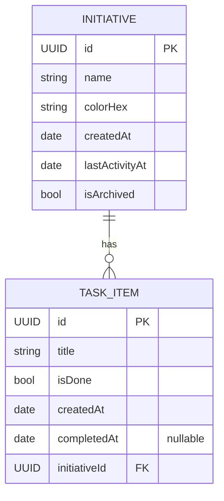
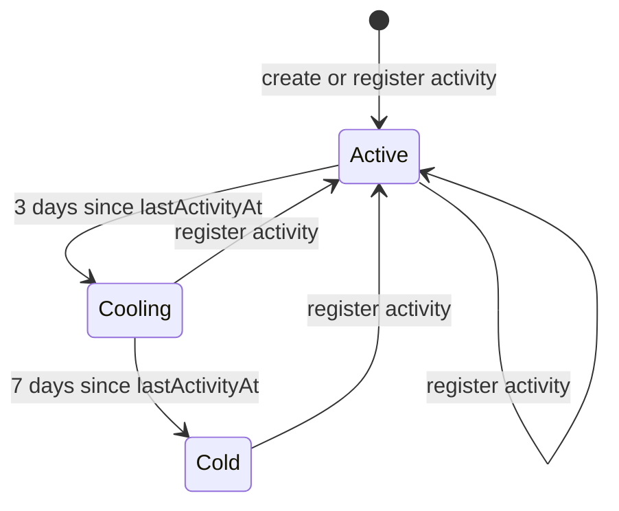

# Momentum — Data Model

> Concrete shape of the SwiftData store. The **why** lives in [ARCHITECTURE.md](ARCHITECTURE.md); the surrounding feature spec in [SPEC.md](SPEC.md).

---

## 1. Entity-Relationship Diagram



**Cardinality:** one `Initiative` → many `TaskItem`. Cascade-delete tasks when their initiative is deleted.

---

## 2. Pulse State Machine

`Pulse` is **derived from `lastActivityAt`**, never stored. The transitions are time-driven — the model doesn't carry state, the clock does.



Thresholds (`3`, `7`) live in `PulseThresholds` and are user-tunable in Settings (P7). Until then, defaults are used.

---

## 3. SwiftData Model Sketches

The shape below is for documentation. Actual Swift files land in **P1**; we add `@Attribute(.unique)` / indexes when usage proves the need.

```swift
import Foundation
import SwiftData

@Model
final class Initiative {
    var id: UUID = UUID()
    var name: String
    var colorHex: String
    var createdAt: Date = Date()
    var lastActivityAt: Date = Date()
    var isArchived: Bool = false

    @Relationship(deleteRule: .cascade, inverse: \TaskItem.initiative)
    var tasks: [TaskItem] = []

    init(name: String, colorHex: String) {
        self.name = name
        self.colorHex = colorHex
    }
}

@Model
final class TaskItem {
    var id: UUID = UUID()
    var title: String
    var isDone: Bool = false
    var createdAt: Date = Date()
    var completedAt: Date?

    var initiative: Initiative?

    init(title: String, initiative: Initiative? = nil) {
        self.title = title
        self.initiative = initiative
    }
}
```

```swift
enum Pulse: String, CaseIterable, Sendable {
    case active, cooling, cold
}

struct PulseThresholds: Codable, Sendable {
    var coolingAt: Int  // days
    var coldAt: Int     // days

    static let `default` = PulseThresholds(coolingAt: 3, coldAt: 7)
}
```

### Derived properties (computed in `PulseEngine`, not stored)

```swift
extension Initiative {
    func daysSinceActivity(now: Date = .now) -> Int {
        Calendar.current.dateComponents([.day], from: lastActivityAt, to: now).day ?? 0
    }

    func pulse(now: Date = .now, thresholds: PulseThresholds = .default) -> Pulse {
        let d = daysSinceActivity(now: now)
        if d >= thresholds.coldAt { return .cold }
        if d >= thresholds.coolingAt { return .cooling }
        return .active
    }
}
```

---

## 4. Activity Rules

The single function that resets the pulse:

```swift
@MainActor
@Observable
final class ActivityService {
    let context: ModelContext

    func registerActivity(for initiative: Initiative) {
        initiative.lastActivityAt = .now
    }

    func addTask(_ title: String, to initiative: Initiative) -> TaskItem {
        let task = TaskItem(title: title, initiative: initiative)
        context.insert(task)
        registerActivity(for: initiative)
        return task
    }

    func toggleDone(_ task: TaskItem) {
        task.isDone.toggle()
        task.completedAt = task.isDone ? .now : nil
        if task.isDone, let initiative = task.initiative {
            registerActivity(for: initiative)
        }
    }
}
```

| Event | Resets pulse? |
|---|---|
| Add task | ✅ |
| Complete task | ✅ |
| Uncheck a completed task | ❌ (not forward motion) |
| Rename / recolor initiative | ❌ |
| Edit task title | ❌ |
| Delete task | ❌ |
| Reorder tasks | ❌ |

This is intentional: only *forward motion* counts. Anything else and the metric lies.

---

## 5. Query Patterns

```swift
// Stalest-first (default home sort)
@Query(
  filter: #Predicate<Initiative> { !$0.isArchived },
  sort: \Initiative.lastActivityAt, order: .forward
)
private var initiatives: [Initiative]

// Open tasks under an initiative
@Query private var allTasks: [TaskItem]   // filter happens via predicate in init
```

For dynamic predicates (e.g. "cold initiatives only"), define a small static helper on the model rather than scattering predicate literals across views.

---

## 6. CloudKit Considerations (P3)

SwiftData talks to CloudKit's private DB through `ModelConfiguration(cloudKitDatabase:)`. Constraints CloudKit imposes on us:

- **All non-optional properties need defaults** (already done above).
- **No `@Attribute(.unique)` constraints** beyond the implicit `id`.
- **Relationships must have inverses** and be optional on the to-one side (`TaskItem.initiative` is `Optional`).
- Strings, dates, bools, UUIDs are fine; richer types need `Codable` + `@Attribute(.transformable)`.

Sync status surfaces through `SyncStatusService`, shown in Settings. We don't expose merge conflict UX — last-writer-wins is fine for a single-user, multi-device app.

---

## 7. Schema Evolution

Schema versions live alongside the models (`SchemaV1`, `SchemaV2`, …) when the first migration arrives. Until then, we ship a single unversioned schema. Adding non-optional properties always carries a default to keep migration trivial.

---

## 8. Data Lifecycle

| Action | Effect |
|---|---|
| Delete initiative | Cascade-deletes all tasks; row removed from queries; CloudKit propagates the tombstone. |
| Archive initiative | `isArchived = true`; queries filter it out by default; Settings → "Manage archived" surfaces them; tasks remain attached. |
| Delete task | Removed; does **not** reset pulse. |
| Uncheck task | `isDone = false`, `completedAt = nil`; does **not** reset pulse. |

---

## 9. Sample Test Fixtures (for P8 tests)

```swift
extension Initiative {
    static func fixture(
        name: String = "Sample",
        colorHex: String = "#4F8EF7",
        daysStale: Int = 0
    ) -> Initiative {
        let i = Initiative(name: name, colorHex: colorHex)
        i.lastActivityAt = Calendar.current.date(
            byAdding: .day, value: -daysStale, to: .now
        )!
        return i
    }
}
```

Tests for `PulseEngine` should pin `now:` rather than reading the wall clock — pulse correctness is a pure function and deserves to be tested as one.
